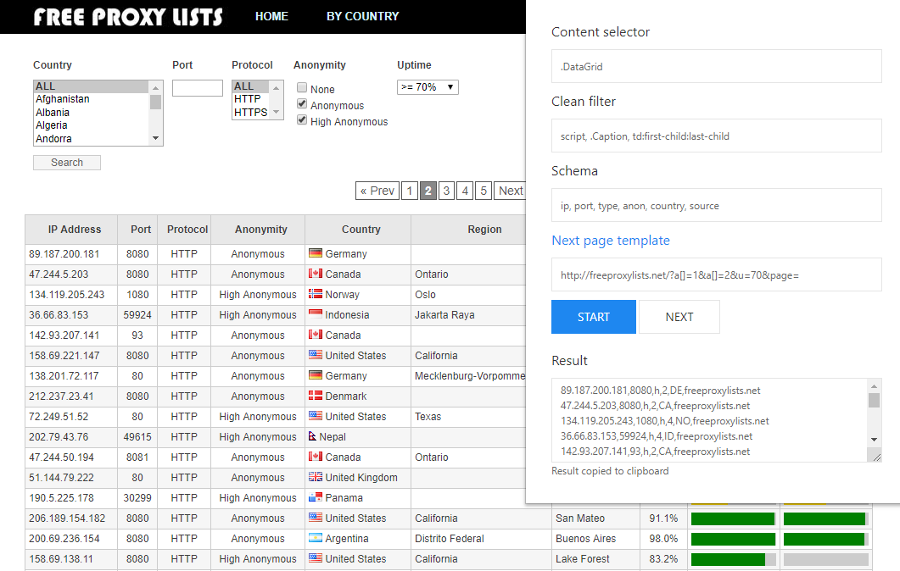

## Proxy parser chrome extension

Makes CSV-like string in one click from tables of public proxy lists

#### Installation
- Run file `build.bat`.
- Open `chrome://extensions/` page in your browser.
- Enable developer mode.
- Click `Load unpacked extension`.
- Select `bundle` folder from the root of this project.
- Use it through common popup window from loaded proxy list page.

#### Preview

